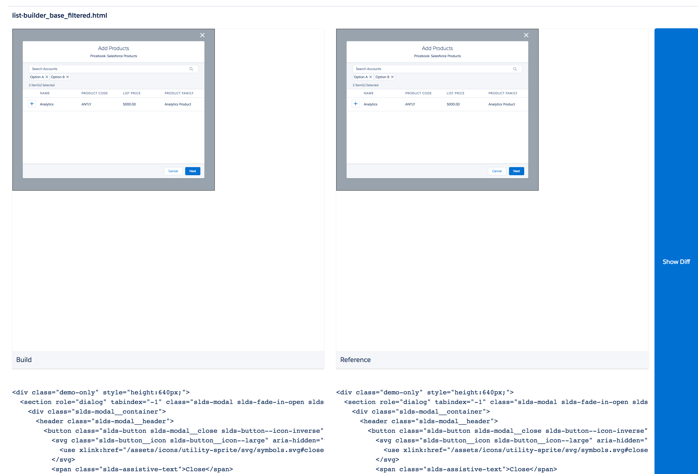
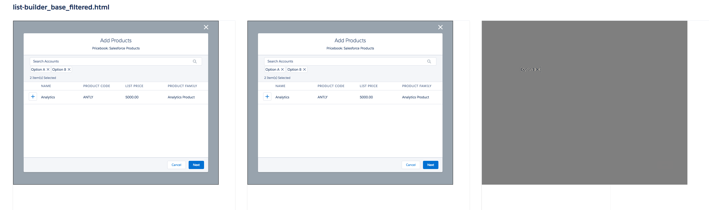
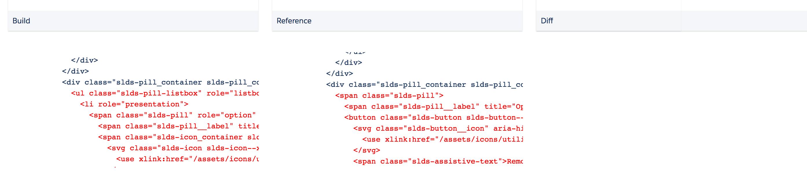

# Instant VRT

VRT based on HTML and computed styles

## Installation

`npm install @saleforce-ux/instant-vrt`

## How it works

1. CI will build snapshots.json using https://github.com/salesforce-ux/create-snap and upload it to s3
  * Renders each example in a headless browser
  * Stores html and all computed styles for each example

2. The snapshots will be compared for differences in 3 ways. Style will not be checked if HTML is different.
  * Checks for a difference on the file contents itself
  * Any html differences
  * Computed Style differences

## How to use it

### Load up the page
Visit https://vrt.lightningdesignsystem.com/report/{SHA1}/{SHA2}. It currently takes a while due to the amount of examples, however, this is being addressed by removing the amount of examples and dynamically applying modifiers.

### View the comparisons
Each test is in an iframe rendering the actual code example.

There is a "Show Diff" button that will lay one image on top of the other and apply a filter + 50% opacity. This has the effect of highlighting anything that is different. It will be 100% grey if there is no visual difference.

Underneath is code. Html and style differences will show up in red.

## Feedback welcome

Add your wishlist features and feedback here: https://salesforce.quip.com/lisVAZaQ2f8S
